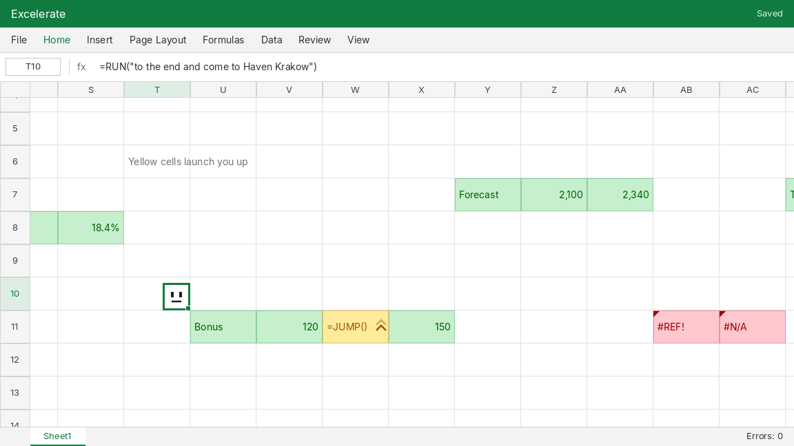

# Excelerate

A small platformer that takes place inside a spreadsheet. 
Made for [Hack Club Haven Jumpstart](https://haven.jumpstart.hackclub.com/) in Godot.

You play as a selected cell and run through the sheet to the end:

- green cells are normal ground
- red cells (`#DIV/0!`, `#REF!`, `#N/A`) are errors and send you back to the start
- yellow `=JUMP()` cells launch you up
- reach `=SAVE()` to finish the level

## Controls

| Key                | Action  |
| ------------------ | ------- |
| A / D or ← / →     | Move    |
| Space, W or ↑      | Jump    |
| R                  | Restart |

## Development

Open the project in Godot 4.7 and press F5.

## Ideas

- [ ] More levels as separate sheet tabs at the bottom
- [ ] Levels based on the Hack Club Haven budget template
- [ ] Mechanics based on real Excel functions (ctr+c)
